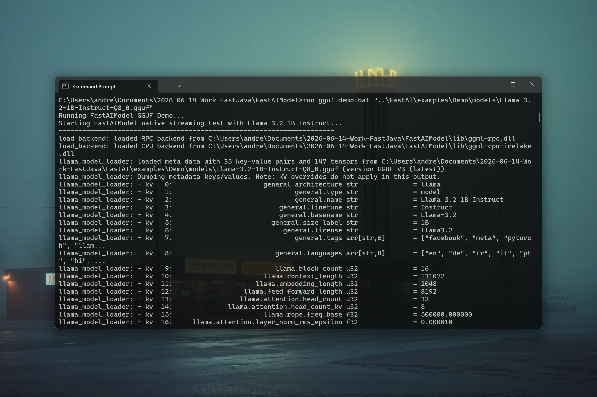

# FastAIModel 0.1.2 — Native Local Inference Runtime for Java

[](https://github.com/andrestubbe/FastAIModel/releases/tag/0.1.2)
[](https://opensource.org/licenses/MIT)
[](https://www.java.com)
[]()
[](https://jitpack.io/#andrestubbe/FastAIModel)

---

**💡 Ultra-fast local LLM and embedding inference directly inside your JVM process — Multi-module architecture for GGUF and ONNX.**

FastAIModel is a **modular local inference engine** for Java that provides separate lightweight modules for `llama.cpp` (GGUF) and `ONNX Runtime` (ONNX). It allows Java applications to run in-process LLM inference and ONNX embeddings with zero HTTP/network overhead.

[](https://youtu.be/pY-39438feM)

---

## Quick Start — ONNX Embeddings (`fastaimodel-onnx`)

```java
import fastaimodel.FastAIOnnxModel;
import ai.onnxruntime.OrtSession;

public class OnnxDemo {
    public static void main(String[] args) {
        // Load ONNX model directly without C++ Llama DLL dependencies
        try (FastAIOnnxModel onnx = new FastAIOnnxModel("models/bge-micro-v2.onnx")) {
            System.out.println("ONNX Session created successfully: " + onnx.getSession());
        }
    }
}
```

## Quick Start — GGUF LLM In-Process Inference (`fastaimodel-llama`)

```java
import fastaimodel.FastAIModel;

public class GgufDemo {
    public static void main(String[] args) {
        // Load local GGUF model via llama.cpp JNI bindings
        try (FastAIModel model = new FastAIModel("models/qwen2.5-coder-1.5b.gguf")) {
            model.predict("Write a quicksort in Java:", 128, token -> {
                System.out.print(token);
                System.out.flush();
            });
        }
    }
}
```

---

## Table of Contents

- [Modular Architecture](#modular-architecture-new-in-012)
- [Why FastAIModel?](#why-fastaimodel)
- [Installation](#installation)
- [Documentation](#documentation)
- [Platform Support](#platform-support)
- [License](#license)

---

## Modular Architecture (New in 0.1.2)

FastAIModel is split into independent modules so you only import what you need:

| Module | Description | Dependencies |
|---|---|---|
| **`fastaimodel-onnx`** | Ultra-lightweight ONNX Runtime wrapper for embeddings | `onnxruntime` (No C++ Llama DLLs needed) |
| **`fastaimodel-llama`** | High-performance C++ `llama.cpp` wrapper for GGUF models | `FastCore`, Native C++ DLLs |

---

## Why FastAIModel?

Running LLMs locally in Java typically requires invoking external subprocesses or running local HTTP servers. FastAIModel eliminates this bloat by running models directly inside your Java process:

- **True In-Process Execution** — Runs the model in the same process space, bypassing system context-switches and network sockets.
- **Zero HTTP/JSON Overhead** — Text and tokens flow directly between Java and C++ memory.
- **Modular Footprint** — Use ONNX embeddings without pulling heavy C++ Llama DLLs.

---

## Installation

### Option 1: ONNX Embeddings Only (`fastaimodel-onnx`)

If you only need ONNX models (e.g. for vector search embeddings):

```xml
<repositories>
    <repository>
        <id>jitpack.io</id>
        <url>https://jitpack.io</url>
    </repository>
</repositories>

<dependencies>
    <dependency>
        <groupId>com.github.andrestubbe.FastAIModel</groupId>
        <artifactId>fastaimodel-onnx</artifactId>
        <version>0.1.2</version>
    </dependency>
</dependencies>
```

### Option 2: GGUF LLM Local Inference (`fastaimodel-llama`)

If you want in-process C++ GGUF LLM execution via `llama.cpp`:

```xml
<dependencies>
    <dependency>
        <groupId>com.github.andrestubbe.FastAIModel</groupId>
        <artifactId>fastaimodel-llama</artifactId>
        <version>0.1.2</version>
    </dependency>
    <!-- Mandatory JNI Loader for C++ DLLs -->
    <dependency>
        <groupId>com.github.andrestubbe</groupId>
        <artifactId>FastCore</artifactId>
        <version>0.1.1</version>
    </dependency>
</dependencies>
```

---

## Documentation

* **[REFERENCE.md](docs/REFERENCE.md)**: JNI contracts and module specifications.
* **[PHILOSOPHY.md](docs/PHILOSOPHY.md)**: In-process design decisions.
* **[CHANGELOG.md](docs/CHANGELOG.md)**: Releases history.

---

## Platform Support

| Platform | Status |
|---|---|
| Windows 10/11 (x64) | ✅ Fully Supported |
| Linux | 🚧 Planned |
| macOS | 🚧 Planned |

---

## Related Projects

- [FastAI](https://github.com/andrestubbe/FastAI) - Unified AI client interface for Java
- [FastAIMemory](https://github.com/andrestubbe/FastAIMemory) - Unified conversation history and prompt formatters
- [FastCore](https://github.com/andrestubbe/FastCore) - Unified JNI loader and platform abstraction

---

## License

MIT License — See [LICENSE](LICENSE) file for details.

---

**Part of the FastJava Ecosystem** — *Making the JVM faster. Small package. Maximum speed. Zero bloat. 🚀📋*
